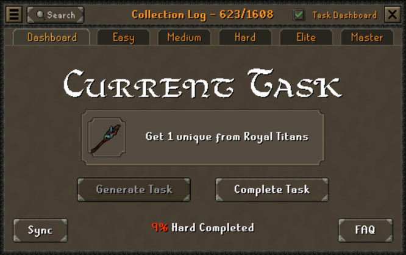
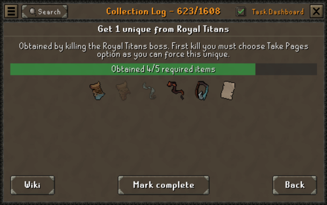
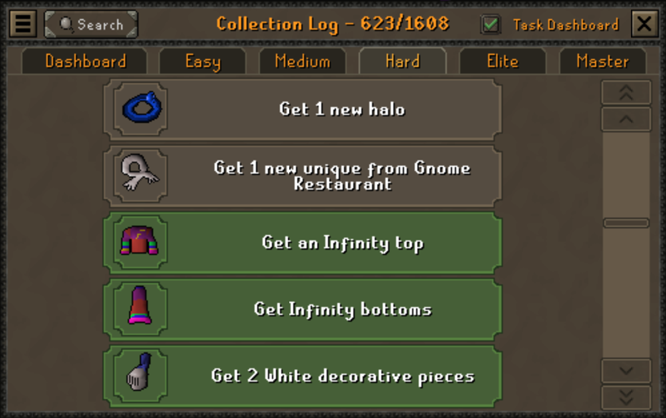

# Collection Log Master ![Plugin Rank][plugin-rank] ![Total Installs][plugin-installs]

> In-game dashboard to roll your next grind; official plugin for the Taskman game mode

- roll from over 900 tasks to complete
- progress through 5 carefully crafted tiers
- join a community of like-minded players

## Features

### Task Dashboard

This is the main interface of the plugin, which can be accessed through the hamburger menu on the
top-left corner of the collection log window. Here you can complete your current task and generate
a new one, with rolling animation for added suspense.

#### Task Information Panel

By clicking on any task, you can access its information panel where you'll get a short ~~and very
useful~~ tip, along with a list of every collection log that would complete that task and how many
you have already obtained. You can also manually mark tasks as complete or incomplete.

#### Task List

By using the tabs at the top, you can navigate through all 5 tiers of tasks and scroll the entire
list.

#### Task Verification

By clicking the _Sync_ button on the bottom-left corner of the Task Dashboard, you can have the
plugin automagically verify which tasks you have already completed.

### `!taskman` command

Want to share with your clan mates what task you're currently working on? Just type `!taskman`
and they'll see it automatically, provided they also have the plugin installed.

## What is Taskman?

A _Taskman_ or _task locked_ account is a game mode where your current grind is always randomly
generated, in the form of a task. Your entire account progression is locked behind what tasks
you roll - and what unlocks come with it -, creating a unique and challenging journey for every
player.

Most tasks require you to get a specific collection log - or a given amount from a specific list
-, but there are also achievement diary tasks and, if you manage to get to master tier, skill cape
tasks. Speaking of tiers, all tasks are split into 5 carefully crafted tiers to guide your
progression in the world of tasking.

This plugin serves primarily as a way for _official Taskmen_ to track their tasks while playing
the game, but many less restricted accounts and even mains have found it to be an interesting tool
to help alleviate some of the choice paralysis we face in this game.

For more information on the Taskman official game mode, please read our [FAQ][faq] or join our
[Discord][discord]!

## YouTube Series

The game mode was initially created by Tedious is his [GenerateTask series][gt-playlist], but over
the years meany creators have fallen in love with it and created their own series. Here's a list of
some of them:

- [Tedious' GenerateTask series][gt-playlist]
- [Nooblet's Tack Locked series][nooblet-playlist]
- [Sug's TaskChase series][chase-playlist]

> If you would like to see your series here, please reach out or open a PR!

[faq]: https://docs.google.com/document/d/e/2PACX-1vTHfXHzMQFbt_iYAP-O88uRhhz3wigh1KMiiuomU7ftli-rL_c3bRqfGYmUliE1EHcIr3LfMx2UTf2U/pub
[discord]: [https://discord.com/invite/bJRDGTSsYh
[plugin-rank]: https://img.shields.io/endpoint?url=https://api.runelite.net/pluginhub/shields/rank/plugin/log-master
[plugin-installs]: https://img.shields.io/endpoint?url=https://api.runelite.net/pluginhub/shields/installs/plugin/log-master
[gt-playlist]: https://www.youtube.com/playlist?list=PLfaYojI_alovHQi7Z_LsThv-MRG_VH10q
[nooblet-playlist]: https://www.youtube.com/playlist?list=PL1AI_3vHNMyTa-7Fptsa0Jhhr7f1epgJY
[chase-playlist]: https://www.youtube.com/playlist?list=PL4j5n1lQjz0kYP2f7XD5CyNBbXgCMykL0

